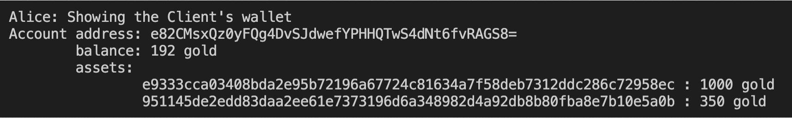

# Spartan-Trading

## Introduction 
Spartan Trading is a decentralized application for buying and selling properties using the [spartan-gold blockchain](https://github.com/taustin/spartan-gold.git) and its currency (gold). In addition to money transaction, it can accept 2 more additional transactions: register property ownership and trading (buying the registered property). Each client will have a wallet, and the process of transaction will use the wallet address. The implementation ideas of this project are based on the concept of [ERC721](https://eips.ethereum.org/EIPS/eip-721) Non-Fungible Token standard. 3 main features: register ownership, trading, wallet. 

## Logic
To sell a property, the seller has to register ownership first, and the registered information will be recorded in the blockchain and the buyer can only buy the registered properties.

### Register ownership
To register ownership, there are a few rules that need to be satisfied:
 - check if it’s already claimed by someone before
 - check if it really exists from the json file (a json file which has a list of propertyId) 
 
Note: There are some limitations with this design, and it will not work in real world situations. 
The current design is first comes first registers, so for example, if client A who registers the property X first, A will be the owner of X, and 
if the client B later registers the property X, it will not work even though B might be the real owner. 
In real world situations, to check the ownership, we need documents like property deed, insurance and property tax.

### Trading 
The Verification Rules for trading a property are as follows:
  - check if it’s registered in Spartan Blockchain
  - check if the owner and seller is the same
  - check if the price is the same
  -	check if the buyer has enough gold to buy
  - If the above rules are satisfied: 
      -	delete the seller ownership from the properties map and register the buyer as the owner, update the information in the blockchain
      - buyer pays the seller
 
 ### Wallet
 Each client will have a wallet. Each wallet has address, keypair, balance, assets. Each asset will have unique id, and its net worth. The information of client’s wallet is fetched from the block: balance map, properties map and prices map. 
 

## Project Files Descriptions 
- House.js 
  -	has 4 fields: latitude, longitude, address, price
-	HashProperties.js: 
    -	hash the list from PropertiesLists.json and push the unique ids to the PropertiesIDLists.json
-	RegisterOwnership.js
    -	validate the register ownership 
    -	behave like a smart contract
-	TradingContract.js
    -	validate trading properties
    -	behave like a smart contract
-	Wallet.js
    -	wallet class 
    -	has client’s address, keypair, balance, assets
-	SpartanBlock.js
    -	extends Block.js from spartan-gold
    - updated the addTransaction method to accept and verify 3 types of tx
    -	updated the rerun method 
-	SpartanMixin.js
    -	mixin for SpartanClient.js and SpartanMiner.js
    -	has related wallet functions
    -	updated postTransaction methods for clients
-	SpartanClient.js
    -	extends Client.js from spartan-gold
    -	use SpartanMixin class
-	SpartanMiner.js
    -	extends Miner.js from spartan-gold
    -	use SpartanMixin class
-	SpartanTransaction.js
    -	extends Transaction.js from spartan-gold
    -	has additional field: txType 
-	TradingDriver.js
    -	updated version of driver.js from spartan-gold
    -	test the verification rules for 3 types of tx
    -	test on possible attacks 
    -	test if the wallet shows the correct client’s information 
-	app.js
    -	express application
    -	listens on Port 3000
    -	has 3 routes
    -	root shows the list of propertyId from PropertiesIDLists.json (convenient reference to test)
    -	/alice – can transfer money, register, buy, and show wallet
    -	/bob – same as alice
-	views folder
    -	has ejs files 
    -	to render html codes with JavaScript data

## Useful Information
- [spartain-gold blockchain](https://github.com/taustin/spartan-gold)
- [ERC721](https://eips.ethereum.org/EIPS/eip-721)

